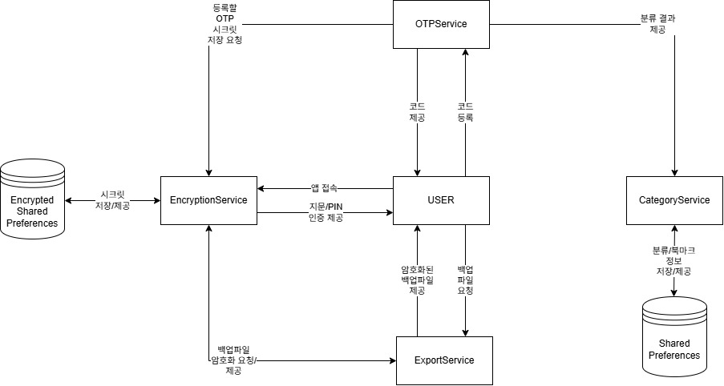

* 22212080 이지섭
* https://github.com/awidksp9843/authcat

**Revision History**
| Version | Date | Description |
|------|------|------|
| #1 | 2026-03-20 | init |
| #2 | 2026-04-29 | 클래스 이름 변경 및 import 기능 추가 |

# AuthCat
## Business Purpose
### 프로젝트 진행 배경
최근 기술 발달과 함께 웹 서비스 이용이 증가하며 해킹을 포함한 여러 종류의 보안 문제가 주는 피해는 기존보다 더 커졌다. 특히 현대의 사용자들은 적게는 수십여개의 웹사이트 및 서비스를 사용하기위해 회원가입을 하는데, 이 때 입력하는 통상적인 인증 정보인 아이디와 비밀번호를 관리하는데 불편함을 겪고있다. 이로 인해 브라우저 자체의 '비밀번호 관리자'등을 이용하여 안전한게 비밀번호를 저장해두며, 이렇게 한다면 모든 비밀번호를 기억할 필요없이 편리하게 로그인을 할 수 있다.

하지만 이 방식에는 잠재적인 위험이 존재하는데, 모종의 이유로 저장되어 있던 비밀번호가 유출되거나, 기타 사용자의 실수로 유출, 혹은 해킹과 서비스 제공자의 부실한 보안 정책으로 인한 유출등으로 계정정보는 비교적 쉽게 유출될 수 있으며, 이렇게 유출된 크리덴셜들은 헐값에 거래되는 등 2차 피해를 야기할 가능성을 가진다.

이를 해결하기 위해 초기에는 주기적인 비밀번호 변경을 하도록 유도하였지만, 이미 많은 충분히 많은 비밀번호를 가지고 있는 사용자들은 일부러 무시하거나 기존 비밀번호와 매우 유사한 패턴으로 변경, 심지어는 다른 웹사이트에서 사용하는 비밀번호와 동일하게 설정하는 등 실제로는 보안적인 관점에서 무의미한 결과를 가져오기만 하고 있다.

이를 해결하기 위해 최근 여러 서비스에서 도입하고 있는 것이 OTP 비밀번호이다. 미리 등록된 신뢰할 수 있는 기기에서 생성되는 일회용 비밀번호인 OTP를 이용하여서, 아이디와 비밀번호를 알고 있다고 해도, 일정 주기로 갱신되는 최신 OTP 비밀번호를 입력하지 못하면 로그인을 못하게 하여 보안 수준을 높인 것이다.

하지만 이는 곧 사용하는 서비스의 개수만큼 여전히 OTP를 관리해야 한다는 것이다. 물론 보안과 편리성은 반비례한다고는 하지만 일반 사용자 입장에서는 불편할것이다. 특히, 구글에서 만든 'Google Authenticator' 앱은 단순히 등록된 OTP를 모두 나열해주기 때문에 원하는 서비스의 OTP를 바로 찾기가 힘들다. 검색 기능이 있긴 하지만 매번 키보드로 입력해 찾는것도 귀찮을 것이다. 타사 앱 중에는 카테고리 기능을 지원하는 앱이 있긴 하지만, 광고나 인앱결제 기능이 포함되어 있는 등 가볍게 쓰기에는 적합하지 않은 형태이다.

따라서 오직 OTP 앱 본연의 기능에 충실하며 가볍고 사용하기 편리한 앱을 개발하기 위하여 이 프로젝트를 진행하게 되었다.

### 목표
수많은 OTP 비밀번호 중 사용 빈도가 높은 것을 우선적으로 보여주거나 사용자가 원하는대로 고정할 수도 있고, 유사 혹은 동일한 서비스에 대한 OTP를 카테고리로 묶는 등의 기능을 지원하여 많은 비밀번호 속에서 사용자가 최대한 빠르고 편리하게 찾아서 로그인을 할 수 있도록 도울 수 있는 애플리케이션을 개발한다. 또한 기기 분실·교체 상황에 대비한 암호화 백업 및 복원 기능을 제공하여 OTP 데이터를 안전하게 보호하고 언제든지 되찾을 수 있도록 한다.

### 타겟
* OTP 앱을 사용하는 사용자 중 많은 OTP로 인해 사용에 불편함을 느끼는 사용자들

## System Context Diagram

* OTPService: OTP 코드를 관리한다
* CategoryService: 정렬 처리 등으로 사용자 편의성 제공
* BackupService: 백업 파일 내보내기 및 외부 백업 파일 가져오기(복원) 제공
* EncryptionService: 데이터 암호화·복호화 및 보안 저장 전담
* AuthService: 생체 인증, 자동 잠금, 캡처 방지 등 인증·접근 제어 담당

## Use Case List
* OTPService
  * actor: user
  * 사용자가 등록한 OTP를 저장/수정/삭제하거나 요청에 의해 실시간 OTP 코드를 제공한다

* CategoryService
  * actor: user, App
  * 미리 적절히 정렬 및 분류된 배치 정보를 반환하거나 사용자의 요청에 의해 특정 키들은 북마크한다

* BackupService
  * actor: user
  * 사용자의 요청에 의해 암호화된 백업 파일을 내보내거나, 외부 백업 파일을 가져와 OTP 데이터를 복원한다

* EncryptionService
  * actor: OTPService, BackupService
  * OTP 저장·조회 및 백업 파일 생성에 요구되는 암호화·복호화 로직을 처리한다

* AuthService
  * actor: user, App
  * 생체 인증(지문/얼굴) 및 PIN을 통한 앱 잠금 해제를 처리하고, 백그라운드 진입 시 자동 잠금 및 캡처 방지를 적용한다

## Concept of Operation
* OTPService

| 항목 | 내용 |
|---|---|
| Purpose | 사용자는 새로운 OTP를 저장하거나 필요할 때 확인할 수 있어야 하며, 기존 OTP를 수정하거나 삭제할 수 있어야 한다 |
| Approach | 추가 메뉴를 통해 직접 입력 혹은 QR스캔 방식으로 시크릿 정보를 인식시키면 신규 추가, 수정 메뉴를 통해 이름과 카테고리 변경, 삭제 확인 후 항목 제거가 가능하다. TOTP 코드는 외부 라이브러리(otp-java)에 시크릿 값을 전달하여 실시간으로 생성한다 |
| Dynamics | 유효하지 않은 형식의 값을 입력한 경우에는 오류를 표시하며 처리 중단. 삭제 시 복구 불가 경고 다이얼로그를 표시한 후 처리 |
| Goals | OTP 사용에 불편함이 없도록 한다 |

* CategoryService

| 항목 | 내용 |
|---|---|
| Purpose | 사용자의 조회 편의성을 위해 정렬 및 분류되어야한다 |
| Approach | 기본적으로 같은 서비스의 OTP는 그룹화하며, 사용자의 지정에 따라 그룹화가 지정될 수 있으며, 사용 빈도수를 고려하여 정렬 순서를 변경하거나 특별한 OTP들은 사용자가 북마크(고정)시킬 수 있어야한다 |
| Dynamics | 사용자가 자신의 기호에 맞게 순서를 편집하려는 경우 |
| Goals | 사용자가 OTP 조회에 있어 최대한 빠르고 편리하게 접근 가능할 수 있도록 한다 |

* BackupService

| 항목 | 내용 |
|---|---|
| Purpose | 유사시를 대비하여 OTP들을 백업하고, 필요 시 복원할 수 있어야 한다 |
| Approach | 사용자는 데이터 손실 및 기기 고장에 대비하여 OTP의 시크릿 값을 백업할 수 있어야 하며, 백업 결과는 사용자의 선택에 따라 암호화된 파일 혹은 평문으로 제공한다. 평문 제공 시에는 강력한 경고가 표시된다. 또한 사용자는 외부 백업 파일을 선택하여 가져올 수 있으며, 암호화된 파일은 비밀번호 입력 후 복호화하여 복원한다 |
| Dynamics | 사용자가 OTP 내보내기(백업) 파일을 요청하는 경우 제공한다. 가져오기 시 중복 항목에 대해 덮어쓰기 또는 건너뛰기 처리 방식을 사용자가 선택할 수 있다 |
| Goals | 보안에 익숙하지 않은 사용자가 백업 파일을 안전하게 다루며 만일에 대비하고, 복원 기능을 통해 기기 분실 및 교체 상황에서도 OTP 데이터를 안전하게 되찾을 수 있도록 도와준다 |

* EncryptionService

| 항목 | 내용 |
|---|---|
| Purpose | OTP 데이터 및 백업 파일에 대한 암호화/복호화 처리 |
| Approach | OTP 저장/조회 혹은 백업 파일 생성 등 보안이 요구되는 프로세스에 대해 EncryptedSharedPreferences를 통하여 안전하게 필요한 암호화/복호화 로직을 처리하여 제공한다 |
| Dynamics | OTPService 또는 BackupService의 요청에 의해 암호화/복호화 로직을 처리한다 |
| Goals | 보안 처리를 한 곳에서 담당하여 관리 및 유지보수가 용이하도록 한다 |

* AuthService

| 항목 | 내용 |
|---|---|
| Purpose | 앱 및 저장된 OTP 데이터에 대한 비인가 접근을 방지한다 |
| Approach | BiometricPrompt API를 통해 생체 인증을 요청하고, 실패 혹은 불가 시 PIN 인증으로 대체한다. 백그라운드 진입 감지 시 자동 잠금을 적용하며, FLAG_SECURE로 캡처를 방지한다 |
| Dynamics | 생체 인증 실패 횟수 초과 시 PIN 입력으로 전환, 인증 성공 전까지 앱 내 데이터 접근 차단 |
| Goals | 기기를 탈취당하거나 화면 녹화 시도가 있더라도 OTP 데이터 노출을 최소화한다 |

## Problem Statement
- 제 3자의 단말 접근
2FA로서 제 3자의 인증 수단 접근이 어느정도 배제되지만, 인증 정보가 저장된 기기를 분실 혹은 탈취당하거나 내부 악성 프로그램에 의해 화면 녹화 등을 이용한 탈취 시도 가능성이 여전히 있으므로 AuthService를 통한 생체 인증, 자동 잠금, 캡처 방지 등의 기술을 적용하여 최대한 방지한다.

- 시크릿 코드의 유실
사용자가 앱 혹은 OTP를 실수로 삭제하는 경우 일반적인 방식으로는 해당 OTP를 사용하던 계정에 접근이 불가능하게 된다. 이를 방지하기 위해서 초기 등록시 사용된 시크릿 값을 백업해둘 필요가 있다. 물론 이것이 유출되면 OTP 자체가 유출되는 것과 동일하므로 암호화 하여 내보낼 필요가 있다. 백업 파일은 BackupService를 통해 내보내고, 동일한 BackupService의 가져오기 기능을 통해 복원할 수 있다.

## Glossary
* **OTP**: One-Time Password, 일정 주기로 갱신되는 일회용 비밀번호

* **TOTP**: Time-based One-time Password, 시간 데이터를 기반으로 OTP를 생성하는 기술

* **RFC 6238**: 국제 인터넷 표준화 기구(IETF)에서 표준으로 규정한 TOTP 알고리즘의 기술 규격 명칭

* **2FA**: Two-Factor Authentication, 비밀번호 이외의 추가적인 인증 요소로, SMS인증/OTP/생체인식 등이 포함된다

* **FLAG_SECURE**: Android에서 특정 화면의 스크린샷·화면 녹화를 OS 수준에서 차단하는 플래그

* **EncryptedSharedPreferences**: Android Jetpack Security에서 제공하는 암호화된 키-값 저장소

* **Base32**: OTP 시크릿 키에 사용되는 인코딩 방식으로, QR코드 및 수동 입력 시 표준 형식

## References
https://en.wikipedia.org/wiki/Google_Authenticator
https://datatracker.ietf.org/doc/html/rfc6238
https://github.com/BastiaanJansen/otp-java
