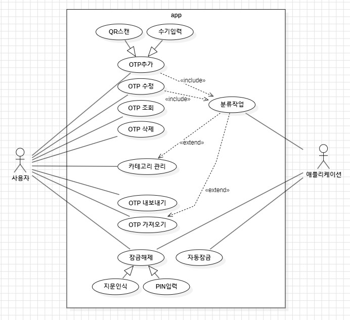
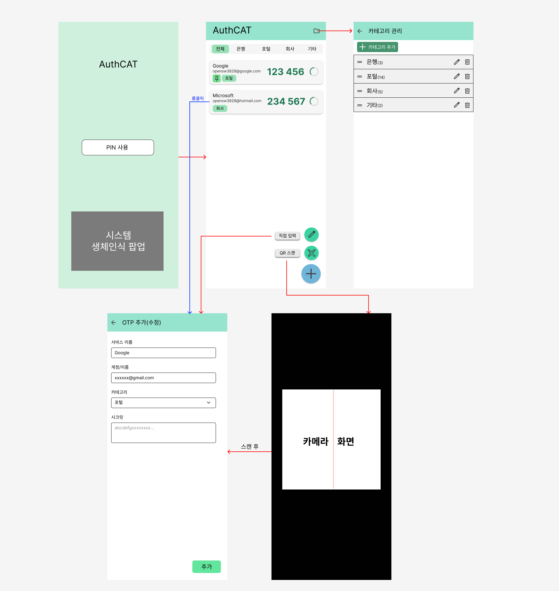

* 22212080 이지섭
* https://github.com/awidksp9843/authcat

**Revision History**
| Version | Date | Description |
|------|------|------|
| #1 | 2026-04-29 | init |

---

# Analysis
## 1. Introduction
AuthCat 개발에 앞서 분석 단계를 위한 문서이다. AuthCat은 다수의 OTP를 사용하는 사용자가 원하는 OTP를 빠르고 편리하게 찾아 사용할 수 있도록 카테고리 분류, 북마크, 사용 빈도 기반 자동 정렬 기능을 제공하는 안드로이드용 OTP 관리 애플리케이션이다.
본 문서에서는 컨셉 단계에서 도출된 내용을 바탕으로 시스템이 제공해야 할 기능을 유스케이스 관점에서 구체화하고, 이를 구현하기 위한 도메인 클래스 구조를 분석한다. 또한 실제 사용자 흐름을 반영한 UI 프로토타입을 제시하여 이후 설계 및 구현 단계의 기준으로 삼는다.
이 앱은 OTP 시크릿을 EncryptedSharedPreferences에 암호화하여 저장하고, 생체 인증 및 자동 잠금을 통해 비인가 접근을 차단하는 등 보안성과 편의성을 동시에 챙기는 것을 목표로 한다.

## 2. Use Case Analysis
### 2.1 Use Case Diagram

앱의 잠금이 해제된 상태는 모든 유스케이스의 전제 조건이므로 별도의 유스케이스로 표현하지 않는다

### 2.2 Use Case Description
#### Use Case #01: OTP추가 - QR스캔
| GENERAL CHARACTERISTICS | |
| :--- | :--- |
| **Summary** | 타 서비스에서 제공되는 QR코드를 스캔하여 OTP 코드를 쉽게 추가할 수 있다. |
| **Scope** | authcat |
| **Level** | User level |
| **Last Update** | 2026-05-02 |
| **Status** | Analysis |
| **Primary Actor** | User |
| **Preconditions** | 앱이 잠금이 해제되어 있고, 카메라가 사용가능한 기기여야한다. |
| **Trigger** | 사용자가 추가 버튼 중 QR추가 버튼을 누를 때 |
| **Success Post Condition** | 스캔된 정보를 바탕으로 OTP코드를 저장하고 즉시 목록에 표시한다 |
| **Failed Post Condition** | 추가에 실패한 이유를 경고창에 작성하여 사용자에게 표시한다 |

| MAIN SUCCESS SCENARIO | |
| :--- | :--- |
| **Step** | **Action** |
| **S** | 사용자가 QR코드 스캔으로 OTP를 추가한다 |
| **1** | 이 유스케이스는 사용자가 추가 버튼을 누를 때 시작된다 |
| **2** | 사용자는 'QR추가' 버튼을 누른다 |
| **3** | 앱은 카메라 사용 가능 여부를 점검한다 |
| **4** | 카메라가 사용가능하면 카메라 화면을 화면에 표시하며 스캔을 시도한다 |
| **5** | 사용자는 QR코드를 카메라에 비춘다 |
| **6** | 앱은 스캔된 데이터가 유효한지 검증한다 |
| **7** | 유효한 데이터라면 EncryptionService가 OTP 시크릿을 암호화하여 추가한다 |
| **8** | CategoryService가 추가된 OTP를 기존 기준에 따라 분류한다 |
| **9** | 이 유스케이스는 OTP 추가에 성공하면 끝난다 |

| EXTENSION SCENARIOS | |
| :--- | :--- |
| **Step** | **Branching Action** |
| **3** | **3a 카메라를 사용할 수 없다** |
| | 3a.1 카메라 연결 시도를 중단한다 |
| | 3a.2 카메라를 사용할 수 없는 이유를 경고창에 표시한다 |
| | 3a.3 더이상 진행이 불가능하므로 유스케이스를 중단한다 |
| **6** | **6a 데이터가 유효하지 않다** |
| | 6a.1 경고창에 OTP용 QR이 아님을 표시한다 |
| | 6a.2 다른 QR을 찾기 위해 계속해서 스캔을 시도한다 (Use case #01-5) |

| RELATED INFORMATION | |
| :--- | :--- |
| **Performance** | ≤ 1 Seconds(스캔부터 추가까지) |
| **Frequency** | 일주일 평균 1-2회 |
| **Due Date** | 2026-05-12 |

#### Use Case #02: OTP추가 - 수기입력
| GENERAL CHARACTERISTICS | |
| :--- | :--- |
| **Summary** | 사용자가 서비스의 이름과 시크릿 키 등을 직접 입력하여 OTP 코드를 추가한다 |
| **Scope** | authcat |
| **Level** | User level |
| **Last Update** | 2026-05-02 |
| **Status** | Analysis |
| **Primary Actor** | User |
| **Preconditions** | 앱의 잠금이 해제되어 있어야 한다 |
| **Trigger** | 사용자가 추가 버튼 중 '직접 입력' 버튼을 누를 때 |
| **Success Post Condition** | 입력된 정보를 암호화하여 저장하고 즉시 목록에 표시한다 |
| **Failed Post Condition** | 유효성 검사 실패 시 이유를 경고창에 표시하고 입력을 유지한다 |

| MAIN SUCCESS SCENARIO | |
| :--- | :--- |
| **Step** | **Action** |
| **S** | 사용자가 직접 입력을 통해 OTP를 추가한다 |
| **1** | 이 유스케이스는 사용자가 추가 버튼을 누를 때 시작된다 |
| **2** | 사용자는 '직접 입력' 버튼을 누른다 |
| **3** | 앱은 OTP 정보(이름, 발행처, 시크릿 키 등)를 입력할 수 있는 폼을 표시한다 |
| **4** | 사용자는 각 항목에 맞는 정보를 텍스트로 입력한다 |
| **5** | 사용자는 해당 OTP를 할당할 카테고리를 선택한다 |
| **6** | 사용자가 '저장' 버튼을 누른다 |
| **7** | 앱은 시크릿의 유효성을 검증한다 |
| **8** | EncryptionService가 데이터를 암호화하여 보안 저장소에 추가한다 |
| **9** | CategoryService가 추가된 OTP를 기존 기준에 따라 분류한다 |
| **10** | 이 유스케이스는 OTP 추가에 성공하면 끝난다 |

| EXTENSION SCENARIOS | |
| :--- | :--- |
| **Step** | **Branching Action** |
| **7** | **6a 시크릿 키 형식이 유효하지 않다** |
| | 7a.1 경고창에 잘못된 형식임을 알리는 메시지를 표시한다. |
| | 7a.2 사용자가 정보를 수정할 수 있도록 입력 폼 상태를 유지한다 (Use case #02-4) |
| **8** | **7a 시스템 저장 오류가 발생한다** |
| | 8a.1 저장에 실패했음을 알리는 경고창을 표시한다 |
| | 8a.2 유스케이스를 중단하고 이전 화면으로 돌아간다 |

| RELATED INFORMATION | |
| :--- | :--- |
| **Performance** | ≤ 1 Seconds (입력 직후부터 추가까지) |
| **Frequency** | 한달 평균 1회 |
| **Due Date** | 2026-05-12 |

#### Use Case #03: OTP수정
| GENERAL CHARACTERISTICS | |
| :--- | :--- |
| **Summary** | 이미 등록되어 있는 OTP의 시크릿을 제외한 메타데이터를 편집한다 |
| **Scope** | authcat |
| **Level** | User level |
| **Last Update** | 2026-05-02 |
| **Status** | Analysis |
| **Primary Actor** | User |
| **Preconditions** | 앱의 잠금이 해제되어 있어야 하며, 저장된 OTP가 1개 이상 있어야한다 |
| **Trigger** | 사용자가 각 OTP의 편집 버튼을 누를 때 |
| **Success Post Condition** | 변경된 정보를 바탕으로 재정렬 후 목록에 즉시 반영한다 |
| **Failed Post Condition** | 수정에 실패할 경우 기존 정보로 복원 후, 실패 이유를 경고창에 표시한다 |

| MAIN SUCCESS SCENARIO | |
| :--- | :--- |
| **Step** | **Action** |
| **S** | 사용자가 OTP의 정보를 수정한다 |
| **1** | 이 유스케이스는 사용자가 각 OTP의 편집 버튼을 누를 때 시작된다 |
| **2** | 사용자는 '편집' 버튼을 누른다 |
| **3** | 앱은 OTP 정보를 수정할 수 있는 폼을 표시한다 |
| **4** | 사용자는 원하는 정보를 수정하여 입력한다 |
| **5** | 사용자가 '저장' 버튼을 누른다 |
| **6** | 앱은 수정된 정보의 유효성을 검증 후 저장한다 |
| **7** | CategoryService가 수정된 OTP를 새 기준에 따라 분류한다 |
| **8** | 이 유스케이스는 OTP 수정에 성공하면 끝난다 |

| EXTENSION SCENARIOS | |
| :--- | :--- |
| **Step** | **Branching Action** |
| **6** | **6a 유효성 검사가 실패한다** |
| | 6a.1 유효성 실패 사유를 알리는 경고창을 표시한다 |
| | 6a.2 다시 사용자가 입력을 수정할 수 있도록 한다 (Use case #03-4) |
| | **6b 시스템 저장 오류가 발생한다** |
| | 6b.1 저장에 실패했음을 알리는 경고창을 표시한다 |
| | 6b.2 유스케이스를 중단하고 이전 화면으로 돌아간다 |

| RELATED INFORMATION | |
| :--- | :--- |
| **Performance** | ≤ 1 Seconds (입력 직후부터 추가까지) |
| **Frequency** | 일주일 평균 5회 |
| **Due Date** | 2026-05-12 |

#### Use Case #04: OTP조회
| GENERAL CHARACTERISTICS | |
| :--- | :--- |
| **Summary** | 이미 등록되어 있는 OTP를 실시간으로 확인한다 |
| **Scope** | authcat |
| **Level** | User level |
| **Last Update** | 2026-05-02 |
| **Status** | Analysis |
| **Primary Actor** | User |
| **Preconditions** | 앱의 잠금이 해제되어 있어야 하며, 저장된 OTP가 1개 이상 있어야한다 |
| **Trigger** | 메인 화면에 위치할 때 |
| **Success Post Condition** | 실시간으로 OTP와 유효시간을 표시한다 |
| **Failed Post Condition** | OTP를 불러오지 못한 이유를 경고창에 표시하거나, 표시할 OTP가 없다면 화면에 작은 글씨로 표시한다 |

| MAIN SUCCESS SCENARIO | |
| :--- | :--- |
| **Step** | **Action** |
| **S** | 사용자가 OTP를 확인한다 |
| **1** | 이 유스케이스는 사용자가 메인화면에 위치할 때 시작된다 |
| **2** | 사용자는 메인화면에 진입한다 |
| **3** | 앱은 존재하는 모든 OTP 목록을 가져온다 |
| **4** | 미리 정해진 기준에 따라 분류를 하여 정해진 위치에 표시한다 |
| **5** | 각 OTP의 유효시간을 매초 갱신한다 |
| **6** | 유효시간이 초과된 OTP는 번호를 다시 갱신한다 |
| **7** | 이 유스케이스는 사용자가 메인화면에서 벗어나면 끝난다 |

| EXTENSION SCENARIOS | |
| :--- | :--- |
| **Step** | **Branching Action** |
| **3** | **3a 표시할 OTP가 없는 경우** |
| | 3a.1 메인화면 가운데에 OTP가 없음을 알리는 작은 글자를 표시한다 |

| RELATED INFORMATION | |
| :--- | :--- |
| **Performance** | ≤ 1 Seconds |
| **Frequency** | 매일 평균 6회 |
| **Due Date** | 2026-05-12 |

#### Use Case #05: OTP삭제
| GENERAL CHARACTERISTICS | |
| :--- | :--- |
| **Summary** | 이미 등록되어 있는 OTP를 삭제한다 |
| **Scope** | authcat |
| **Level** | User level |
| **Last Update** | 2026-05-02 |
| **Status** | Analysis |
| **Primary Actor** | User |
| **Preconditions** | 앱의 잠금이 해제되어 있어야 하며, 저장된 OTP가 1개 이상 있어야한다 |
| **Trigger** | 해당 OTP의 삭제 버튼을 누를 때 |
| **Success Post Condition** | 해당 OTP와 관련된 모든 정보를 제거하고 목록에서 없앤다 |
| **Failed Post Condition** | OTP를 삭제하지 못한 이유를 경고창에 표시한다 |

| MAIN SUCCESS SCENARIO | |
| :--- | :--- |
| **Step** | **Action** |
| **S** | 사용자가 OTP를 삭제한다 |
| **1** | 이 유스케이스는 사용자가 특정 OTP의 삭제 버튼을 누를 때 시작된다 |
| **2** | 사용자는 OTP 삭제 버튼을 누른다 |
| **3** | 앱은 복구가 불가능하다는 경고 메시지를 보여준다 |
| **4** | 사용자는 삭제를 취소하거나 계속한다 |
| **5** | 앱은 사용자의 선택에 따라 삭제를 취소하거나 진행한다 |
| **6** | 이 유스케이스는 OTP가 삭제되면 끝난다 |

| EXTENSION SCENARIOS | |
| :--- | :--- |
| **Step** | **Branching Action** |
| **5** | **5a OTP 삭제에 실패한 경우** |
| | 5a.1 삭제에 실패한 사유를 경고창으로 띄어준다 |

| RELATED INFORMATION | |
| :--- | :--- |
| **Performance** | ≤ 1 Seconds |
| **Frequency** | 월 평균 1-2회 |
| **Due Date** | 2026-05-12 |

#### Use Case #06: 분류작업
| GENERAL CHARACTERISTICS | |
| :--- | :--- |
| **Summary** | 주어지는 OTP를 기준에 맞게 분류하여 저장한다 |
| **Scope** | authcat |
| **Level** | System level |
| **Last Update** | 2026-05-02 |
| **Status** | Analysis |
| **Primary Actor** | User |
| **Preconditions** | 앱의 잠금이 해제되어 있어야 하며, 저장된 OTP가 1개 이상 있어야한다 |
| **Trigger** | OTP를 추가하거나 수정하거나, 카테고리를 변경할 때 |
| **Success Post Condition** | 새 기준에 맞춰 OTP의 분류 정보를 갱신한다 |
| **Failed Post Condition** | 수정하지 못한 이유를 경고창에 표시한다 |

| MAIN SUCCESS SCENARIO | |
| :--- | :--- |
| **Step** | **Action** |
| **S** | 사용자가 OTP의 분류 기준을 변경한다 |
| **1** | 이 유스케이스는 사용자가 OTP를 추가, 수정하거나 카테고리 정보를 변경할 때 시작된다 |
| **2** | 사용자가 OTP를 추가, 수정하거나 카테고리 정보를 변경한다 |
| **3** | 앱은 OTP의 최종 정보를 바탕으로 분류 데이터를 갱신한다 |
| **4** | 카테고리 변화가 분류에 영향을 미치는지 판단하여 선택적으로 분류를 실시한다 |
| **5** | 이 유스케이스는 재분류가 완료되면 끝난다 |

| EXTENSION SCENARIOS | |
| :--- | :--- |
| **Step** | **Branching Action** |
| **3** | **3a 재분류에 실패한 경우** |
| | 3a.1 재분류에 실패한 사유를 경고창으로 띄어준다 |

| RELATED INFORMATION | |
| :--- | :--- |
| **Performance** | ≤ 1 Seconds |
| **Frequency** | 일주일 평균 1-2회 |
| **Due Date** | 2026-05-12 |

#### Use Case #07: 카테고리 관리
| GENERAL CHARACTERISTICS | |
| :--- | :--- |
| **Summary** | 사용자가 저장된 OTP를 카테고리로 분류한다 |
| **Scope** | authcat |
| **Level** | User level |
| **Last Update** | 2026-05-02 |
| **Status** | Analysis |
| **Primary Actor** | User |
| **Preconditions** | 앱의 잠금이 해제되어 있어야 하며, 저장된 OTP가 1개 이상 있어야한다 |
| **Trigger** | 사용자가 카테고리 관리 화면에 위치하거나, 각 OTP의 수정 폼에서 카테고리를 변경할 때 |
| **Success Post Condition** | 변경된 카테고리 사항이 앱 전역에 적용된다 |
| **Failed Post Condition** | 카테고리를 추가/변경/삭제하는데 실패 했을 때 이유를 경고창에 띄어준다 |

| MAIN SUCCESS SCENARIO | |
| :--- | :--- |
| **Step** | **Action** |
| **S** | 사용자가 카테고리를 관리한다 |
| **1** | 이 유스케이스는 사용자가 카테고리 관리 화면에 위치하거나, 각 OTP의 수정 폼에서 카테고리를 변경할 때 시작된다 |
| **2** | 사용자가 카테고리 정보를 변경하거나 추가한다 |
| **3** | 앱은 DB에 변경된 카테고리 데이터를 반영한다 |
| **4** | 카테고리 변화가 OTP 분류에 영향을 미치는지 판단하여 선택적으로 분류를 실시한다 |
| **5** | 이 유스케이스는 갱신이 완료되면 끝난다 |

| EXTENSION SCENARIOS | |
| :--- | :--- |
| **Step** | **Branching Action** |
| **3** | **3a 정보 반영에 실패한 경우** |
| | 3a.1 실패한 사유를 경고창으로 띄어준다 |

| RELATED INFORMATION | |
| :--- | :--- |
| **Performance** | ≤ 1 Seconds |
| **Frequency** | 일주일 평균 1-2회 |
| **Due Date** | 2026-05-12 |

#### Use Case #08: OTP 내보내기
| GENERAL CHARACTERISTICS | |
| :--- | :--- |
| **Summary** | 사용자가 저장된 OTP 시크릿을 백업할 수 있도록 해준다 |
| **Scope** | authcat |
| **Level** | User level |
| **Last Update** | 2026-05-02 |
| **Status** | Analysis |
| **Primary Actor** | User |
| **Preconditions** | 앱의 잠금이 해제되어 있어야 하며, 저장된 OTP가 1개 이상 있어야한다 |
| **Trigger** | 사용자가 내보내기 버튼을 누를 때 |
| **Success Post Condition** | 암호화된 백업 파일이 생성된다 |
| **Failed Post Condition** | 내보내기에 실패한 이유를 토스트 메시지로 띄어준다 |

| MAIN SUCCESS SCENARIO | |
| :--- | :--- |
| **Step** | **Action** |
| **S** | 사용자가 저장된 OTP를 내보낸다 |
| **1** | 이 유스케이스는 사용자가 내보내기 버튼을 누를 때 시작된다 |
| **2** | 사용자가 내보내기 버튼을 누른다 |
| **3** | 앱은 잠금 해제상태인지 한번 더 확인한다 |
| **4** | 모든 OTP의 시크릿을 파일에 기록 후 비밀번호를 입력받는다 |
| **5** | 사용자는 원하는 비밀번호를 입력한다 |
| **6** | 앱은 해당 비밀번호로 백업 파일을 암호화하여 기기에 저장한다 |
| **7** | 이 유스케이스는 저장이 완료되면 끝난다 |

| EXTENSION SCENARIOS | |
| :--- | :--- |
| **Step** | **Branching Action** |
| **3** | **3a 앱의 잠금 상태가 기준을 충족하지 못하는 경우** |
| | 6a.1 다시 사용자에게 인증을 요구한다 |
| | 6a.2 인증이 성공한 경우에만 내보내기 절차를 계속한다 (Use case #08-4) |
| **6** | **6a 비밀번호가 입력되지 않은 경우** |
| | 6a.1 비밀번호의 중요성을 설명하는 알림창을 띄운다 |
| | 6a.2 비밀번호 입력창을 다시 띄운다 (Use case #08-4) |
| | **6b 파일을 저장할 권한이 없는 경우** |
| | 6b.1 저장소 이용 권한을 요청한다 |
| | 6b.2 다시 저장을 시도한다 (Use case #08-6) |
| | **6c 파일을 저장할 수 없는 경우** |
| | 6c.1 저장에 실패한 이유를 경고창으로 띄어준다 |
| | 6c.2 내보내기 작업을 취소한다 |

| RELATED INFORMATION | |
| :--- | :--- |
| **Performance** | ≤ 3 Seconds |
| **Frequency** | 한달 평균 1회 |
| **Due Date** | 2026-05-12 |

#### Use Case #09: OTP 가져오기
| GENERAL CHARACTERISTICS | |
| :--- | :--- |
| **Summary** | 사용자가 백업해둔 OTP 시크릿을 복원할 수 있도록 해준다 |
| **Scope** | authcat |
| **Level** | User level |
| **Last Update** | 2026-05-02 |
| **Status** | Analysis |
| **Primary Actor** | User |
| **Preconditions** | 앱의 잠금이 해제되어 있어야 하며, 저장된 백업 파일이 있어야한다 |
| **Trigger** | 사용자가 가져오기 버튼을 누를 때 |
| **Success Post Condition** | 복원된 OTP들이 목록에 표시된다 |
| **Failed Post Condition** | 복원하지 못한 이유를 경고창에 표시한다 |

| MAIN SUCCESS SCENARIO | |
| :--- | :--- |
| **Step** | **Action** |
| **S** | 사용자가 저장된 백업파일에서 OTP를 가져온다 |
| **1** | 이 유스케이스는 사용자가 가져오기 버튼을 누를 때 시작된다 |
| **2** | 사용자가 가져오기 버튼을 누른다 |
| **3** | 앱은 잠금 해제상태인지 한번 더 확인한다 |
| **4** | 사용자가 가져올 백업 파일을 선택한다 |
| **5** | 앱은 비밀번호를 묻는 폼을 띄운다 |
| **6** | 사용자는 내보내기 당시 입력했던 비밀번호를 입력한다 |
| **7** | 앱은 비밀번호를 이용해 백업 파일을 복호화하여 읽는다 |
| **8** | 사용자에게 기존 OTP를 유지할지 물어본다 |
| **9** | 사용자는 원하는 선택을 한다 |
| **10** | 앱은 사용자의 선택에 따라 데이터를 복원하고 분류한다 |
| **11** | 이 유스케이스는 가져오기가 완료되면 끝난다 |

| EXTENSION SCENARIOS | |
| :--- | :--- |
| **Step** | **Branching Action** |
| **3** | **3a 앱의 잠금 상태가 기준을 충족하지 못하는 경우** |
| | 6a.1 다시 사용자에게 인증을 요구한다 |
| | 6a.2 인증이 성공한 경우에만 가져오기 절차를 계속한다 (Use case #09-4) |
| **4** | **4a 유효하지 않은 파일형식인 경우** |
| | 4a.1 유효하지 않은 파일임을 알리는 토스트 메시지를 띄운다 |
| | 4a.2 다시 파일 선택을 받는다 (Use case #09-4) |
| **7** | **7a 비밀번호가 잘못된 경우** |
| | 7a.1 유효하지 않은 비밀번호임을 알리는 토스트 메시지를 띄운다 |
| | 7a.2 다시 비밀번호를 입력 받는다 (Use case #09-5) |

| RELATED INFORMATION | |
| :--- | :--- |
| **Performance** | ≤ 3 Seconds |
| **Frequency** | 한달 평균 1회 |
| **Due Date** | 2026-05-12 |

제공해주신 Analysis_[22212080_이지섭].md 파일의 형식과 스타일을 엄격히 준수하여 #10 잠금해제 - 지문인식, #11 잠금해제 - PIN입력, #12 자동잠금에 대한 유스케이스 명세를 작성했습니다.

Markdown
#### Use Case #10: 잠금해제 - 지문인식
| GENERAL CHARACTERISTICS | |
| :--- | :--- |
| **Summary** | 사용자가 기기에 등록된 지문을 사용하여 앱의 잠금을 해제하고 메인 화면에 진입한다 |
| **Scope** | authcat |
| **Level** | User level |
| **Last Update** | 2026-05-02 |
| **Status** | Analysis |
| **Primary Actor** | User |
| **Preconditions** | 앱이 잠금 상태여야 하며, 기기에 지문이 등록되어 있고 앱 설정에서 생체 인증이 활성화되어 있어야 한다 |
| **Trigger** | 앱을 처음 실행하거나 백그라운드에서 포그라운드로 전환될 때 |
| **Success Post Condition** | 잠금이 해제되며 OTP 목록이 보이는 메인 화면으로 이동한다 |
| **Failed Post Condition** | 잠금 상태를 유지하며, 실패 횟수가 초과될 경우 PIN 입력 화면으로 유도한다 |

| MAIN SUCCESS SCENARIO | |
| :--- | :--- |
| **Step** | **Action** |
| **S** | 사용자가 지문 인식을 통해 앱 잠금을 해제한다 |
| **1** | 이 유스케이스는 앱이 잠금 상태에서 활성화될 때 시작된다 |
| **2** | 앱은 시스템 지문 인식 프롬프트를 화면에 표시한다 |
| **3** | 사용자는 기기의 지문 센서에 손가락을 접촉한다 |
| **4** | 앱은 시스템으로부터 전달받은 생체 인증 결과의 유효성을 검증한다 |
| **5** | 인증에 성공하면 잠금 화면을 닫고 메인 화면을 표시한다 |
| **6** | 이 유스케이스는 잠금이 해제되면 끝난다 |

| EXTENSION SCENARIOS | |
| :--- | :--- |
| **Step** | **Branching Action** |
| **4** | **4a 지문이 일치하지 않는다** |
| | 4a.1 진동이나 텍스트를 통해 인증 실패를 알린다 |
| | 4a.2 다시 지문을 스캔할 수 있도록 대기한다 (Use case #10-3) |
| | **4b 지문 인식 실패 횟수가 초과되거나 사용자가 취소한다** |
| | 4b.1 지문 인식 프롬프트를 닫는다 |
| | 4b.2 대체 인증 수단인 PIN 입력 화면을 표시한다 (Use case #11) |

| RELATED INFORMATION | |
| :--- | :--- |
| **Performance** | ≤ 1 Seconds (인식 직후 해제까지) |
| **Frequency** | 앱 사용 시마다 발생 (매일 평균 10회 이상) |
| **Due Date** | 2026-05-12 |

#### Use Case #11: 잠금해제 - PIN입력
| GENERAL CHARACTERISTICS | |
| :--- | :--- |
| **Summary** | 사용자가 설정한 6자리의 PIN 번호를 입력하여 앱의 잠금을 해제한다 |
| **Scope** | authcat |
| **Level** | User level |
| **Last Update** | 2026-05-02 |
| **Status** | Analysis |
| **Primary Actor** | User |
| **Preconditions** | 앱이 잠금 상태여야 하며, 초기 설정에서 PIN 번호가 등록되어 있어야 한다 |
| **Trigger** | 지문 인식 대신 PIN 입력을 선택하거나, 지문 인식 실패로 인해 PIN 입력이 요구될 때 |
| **Success Post Condition** | 입력한 PIN이 저장된 값과 일치하면 잠금을 해제하고 메인 화면으로 이동한다 |
| **Failed Post Condition** | PIN이 일치하지 않으면 오류 메시지를 표시하고 재입력을 요구한다 |

| MAIN SUCCESS SCENARIO | |
| :--- | :--- |
| **Step** | **Action** |
| **S** | 사용자가 PIN 번호를 입력하여 앱 잠금을 해제한다 |
| **1** | 이 유스케이스는 잠금 화면에서 PIN 입력 모드가 활성화될 때 시작된다 |
| **2** | 사용자는 숫자 패드를 사용하여 설정된 PIN 번호를 입력한다 |
| **3** | 앱은 입력된 PIN을 암호화하여 저장된 PIN 데이터와 비교 검증한다 |
| **4** | 데이터가 일치하면 잠금 상태를 해제한다 |
| **5** | 이 유스케이스는 메인 화면이 표시되면 끝난다 |

| EXTENSION SCENARIOS | |
| :--- | :--- |
| **Step** | **Branching Action** |
| **3** | **3a PIN 번호가 일치하지 않는다** |
| | 3a.1 PIN이 틀렸음을 알리는 경고 문구를 표시한다 |
| | 3a.2 입력된 번호를 초기화하고 다시 입력을 시도하게 한다 (Use case #11-2) |

| RELATED INFORMATION | |
| :--- | :--- |
| **Performance** | ≤ 0.5 Seconds (입력 완료 후 검증까지) |
| **Frequency** | 지문 인식 불가 시 또는 사용자의 선택에 따라 발생 |
| **Due Date** | 2026-05-12 |

#### Use Case #12: 자동잠금
| GENERAL CHARACTERISTICS | |
| :--- | :--- |
| **Summary** | 보안을 위해 앱이 백그라운드로 전환되거나 일정 시간 사용이 없으면 자동으로 잠금 상태로 전환한다 |
| **Scope** | authcat |
| **Level** | System level |
| **Last Update** | 2026-05-02 |
| **Status** | Analysis |
| **Primary Actor** | System |
| **Preconditions** | 앱이 잠금이 해제된 상태여야 한다 |
| **Trigger** | 사용자가 앱을 종료하거나 다른 앱으로 전환하여 백그라운드 상태가 될 때, 또는 설정된 유휴 시간이 경과할 때 |
| **Success Post Condition** | 앱의 화면을 보호하고 다음 진입 시 인증 절차를 거치도록 잠금 플래그를 활성화한다 |
| **Failed Post Condition** | 없음 (시스템에 의해 강제 수행됨) |

| MAIN SUCCESS SCENARIO | |
| :--- | :--- |
| **Step** | **Action** |
| **S** | 시스템이 앱을 자동으로 잠금 상태로 전환한다 |
| **1** | 이 유스케이스는 앱이 백그라운드로 전환되는 시스템 이벤트를 감지할 때 시작된다 |
| **2** | 앱은 현재 화면 위에 보안 화면(잠금 레이아웃)을 덮어씌워 데이터를 가린다 |
| **3** | 내부 상태를 '잠금(Locked)'으로 변경한다 |
| **4** | 보안 메모리 내의 임시 데이터를 파기하고 안전하게 저장한다 |
| **5** | 이 유스케이스는 잠금 처리가 완료되면 끝난다 |

| EXTENSION SCENARIOS | |
| :--- | :--- |
| **Step** | **Branching Action** |
| **1** | **1a 설정된 자동 잠금 유휴 시간이 초과된 경우** |
| | 1a.1 앱이 포그라운드 상태이더라도 즉시 잠금 화면을 호출한다 (Use case #12-2) |

| RELATED INFORMATION | |
| :--- | :--- |
| **Performance** | 즉시 실행 |
| **Frequency** | 앱 이탈 시마다 발생 |
| **Due Date** | 2026-05-12 |

## 3. Domain Analysis
### 3.1 Class List & Description

### 3.1 Class List & Description

| Class Name | Description |
| :--- | :--- |
| **OTP** | 단일 OTP 항목의 데이터를 표현하는 도메인 클래스. 서비스 이름, 발행처, 암호화된 시크릿 키, 할당된 카테고리 ID, 즐겨찾기 여부, 사용 빈도수 등의 정보를 담고 있다. |
| **Category** | 사용자가 정의한 분류 기준을 표현하는 도메인 클래스. 카테고리의 고유 ID와 이름 등의 데이터를 포함한다. |
| **OTPRepository** | 기기 내 로컬 데이터베이스에 OTP 및 카테고리 데이터를 추가, 조회, 수정, 삭제(CRUD)하는 데이터 접근 계층을 담당하는 클래스이다. |
| **EncryptionService** | 시스템 보안을 위해 OTP 시크릿 키와 백업 파일의 암호화 및 복호화를 전담하는 클래스. 안드로이드 Keystore 및 EncryptedSharedPreferences와 상호작용한다. |
| **AuthManager** | 앱의 전반적인 잠금 및 인증 상태를 관리하는 클래스. 생체 인식(지문) 호출, PIN 번호 검증, 백그라운드 전환 감지를 통한 자동 잠금 제어 기능을 수행한다. |
| **CategoryService** | 지정된 기준에 맞춰 OTP 목록의 분류 및 정렬 로직을 담당하는 클래스. 사용 빈도, 설정된 카테고리 정보, 북마크 변경 시 이에 맞춰 목록을 재배치한다. |
| **BackupManager** | 사용자의 전체 OTP 데이터를 암호화된 파일 형식으로 기기에 내보내거나(Export), 비밀번호를 통해 기존 백업 파일에서 데이터를 읽어와 복원(Import)하는 기능을 수행한다. |
| **QRScanner** | 카메라 권한을 확인하고 화면을 제어하여 타 서비스의 OTP 등록용 QR 코드를 스캔하며, 유효한 데이터 텍스트를 추출해내는 기능을 담당한다. |
| **OTPGenerator** | 복호화된 시크릿 키와 기기의 현재 시간 정보를 바탕으로 사용자에게 보여줄 실시간 6자리 OTP 코드를 계산하고 생성하는 역할을 한다. |

## 4. User Interface Prototype
### 4.1 UI Design

### 4.2 User Manual (Preliminary)

## 5. Glossary
| Term (용어) | Definition (정의) |
| :--- | :--- |
| **OTP (One-Time Password)** | 고정된 비밀번호의 취약점을 보완하기 위해 도입된, 1회용으로 생성되고 사용 후 폐기되는 임시 비밀번호이다. |
| **TOTP (Time-based One-time Password)** | 시간의 흐름(현재 시간)과 미리 공유된 비밀 키(Secret Key)를 기반으로 하여 주기적으로(일반적으로 30초) 갱신되는 OTP 생성 알고리즘이다. |
| **Secret Key (시크릿 키)** | 사용자의 기기(OTP 앱)와 서비스 제공자 서버 간에 공유되는 고유하고 비밀스러운 문자열. TOTP 생성의 핵심 데이터이다. |
| **2FA (Two-Factor Authentication)** | 사용자 인증 시 지식 기반(비밀번호 등), 소유 기반(OTP 기기 등), 특성 기반(생체 정보) 중 서로 다른 두 가지 요소를 조합하여 보안성을 높이는 이중 인증 방식이다. |
| **EncryptedSharedPreferences** | 안드로이드 Jetpack Security 라이브러리에서 제공하는 기능으로, 로컬 저장소인 SharedPreferences에 저장되는 키(Key)와 값(Value)을 자동으로 암호화하여 데이터 유출을 방지하는 안전한 저장 방식이다. |
| **Base32** | 32진법 인코딩. 알파벳 대문자 26개와 숫자 2~7(6개)을 조합하여 데이터를 표현하며, 혼동하기 쉬운 문자(0과 O, 1과 I 등)를 배제하여 사람이 수기로 입력하기 쉽게 만든 인코딩 방식이다. 주로 OTP 시크릿 키 표기에 사용된다. |
| **BiometricPrompt API** | 안드로이드에서 제공하는 공식 생체 인증(지문, 얼굴 인식 등) 다이얼로그 호출 인터페이스. 일관된 시스템 UI와 강화된 보안 처리를 제공한다. |
| **FLAG_SECURE** | 안드로이드 운영체제 레벨에서 지원하는 보안 플래그로, 앱의 특정 화면(Activity)에 적용 시 해당 화면의 스크린샷 캡처 및 화면 녹화를 차단하는 기능이다. |
| **QR Code (Quick Response Code)** | 흑백 격자 무늬 패턴을 통해 정보를 나타내는 2차원 바코드. AuthCat에서는 복잡한 OTP 시크릿 키 정보를 간편하게 기기에 등록하기 위해 스캔 용도로 사용된다. |

## 6. References
1. IETF (Internet Engineering Task Force). (2011). *RFC 6238: TOTP: Time-Based One-Time Password Algorithm*. https://datatracker.ietf.org/doc/html/rfc6238
2. Android Developers. *EncryptedSharedPreferences*. https://developer.android.com/reference/androidx/security/crypto/EncryptedSharedPreferences
3. Android Developers. *BiometricPrompt*. https://developer.android.com/reference/androidx/biometric/BiometricPrompt
4. Wikipedia. *Google Authenticator*. https://en.wikipedia.org/wiki/Google_Authenticator
5. BastiaanJansen. *otp-java* (Java OTP Library). https://github.com/BastiaanJansen/otp-java