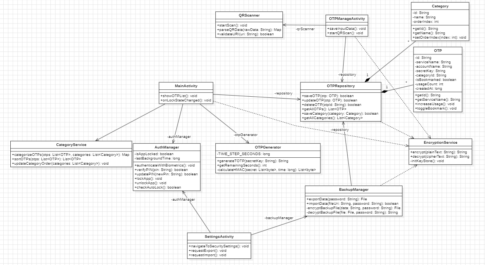
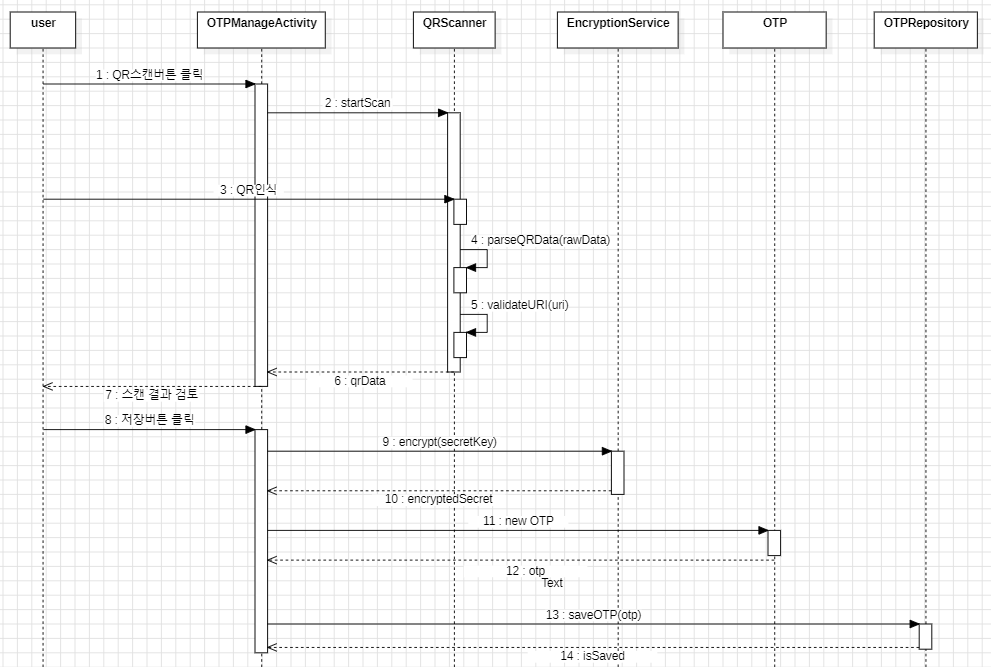
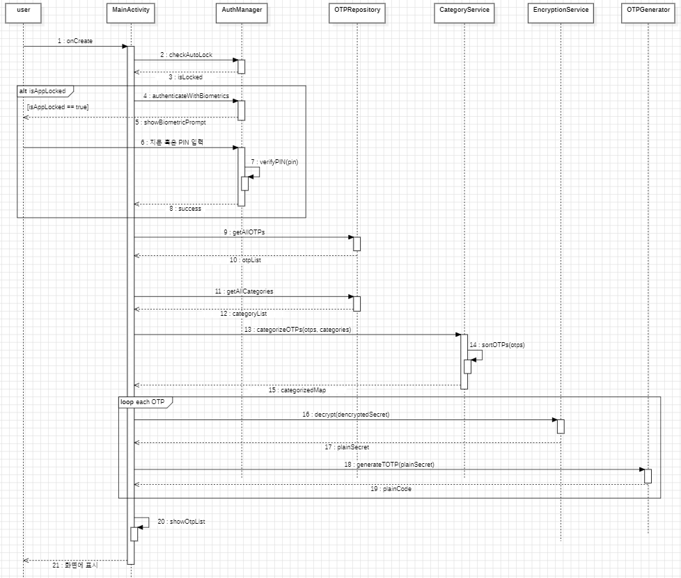
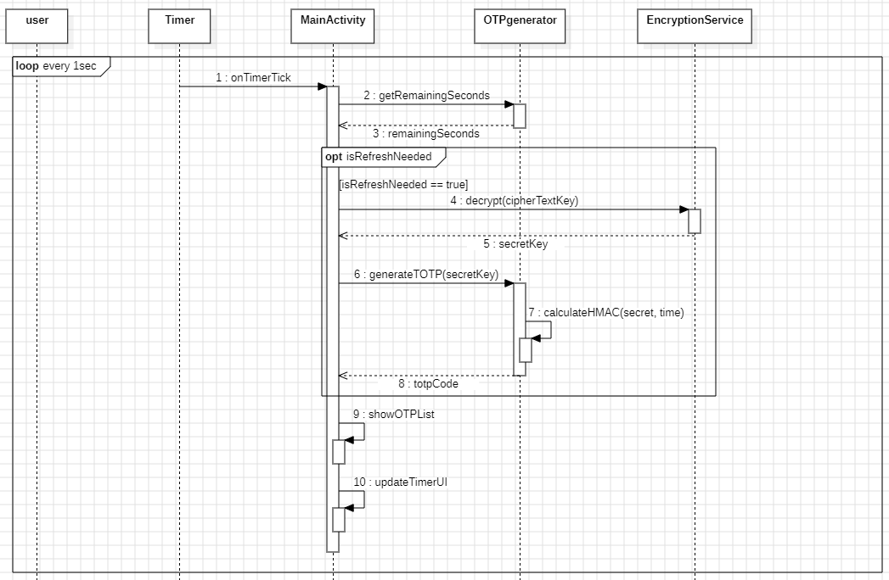
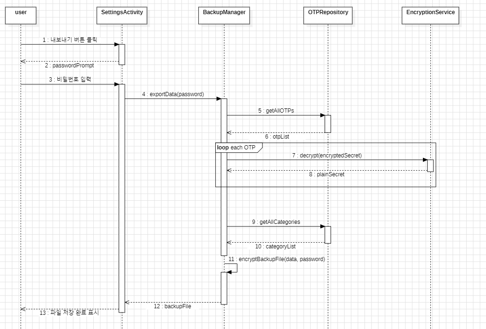
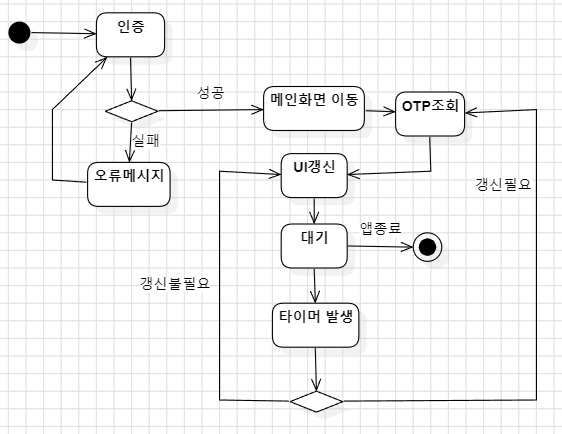

* 22212080 이지섭
* https://github.com/awidksp9843/authcat

**Revision History**
| Version | Date | Description |
|------|------|------|
| #1 | 2026-05-24 | init |

---

# Analysis
## 1. Introduction
이번 단계에서는 이전에 한 분석(Analysis) 단계에서 만들어진 유스케이스 등을 바탕으로, 실제 애플리케이션 구현의 뼈대가 될 상세한 클래스 다이어그램을 설계할 것이다. 또한 시스템의 주요 흐름(인증 시스템, 데이터 입출력, 백업/복원 등)을 시퀀스 다이어그램과 상태 머신 다이어그램으로 표현하여 동작 방식을 더 자세히 나타내어 구현 단계에서 쉽게 구현이 가능하도록 할 것이다.

## 2. Class Diagram

#### OTP
단일 OTP 항목의 데이터를 표현하는 도메인 클래스이다.

| 유형 | 이름 | 타입 | 설명 |
| --- | --- | --- | --- |
| **Attribute** | `- id` | `String` | 해당 OTP 데이터의 고유 식별자 |
| **Attribute** | `- serviceName` | `String` | 서비스 제공자 이름 (예: Google, Microsoft) |
| **Attribute** | `- accountName` | `String` | 사용자 계정 아이디 또는 이메일 |
| **Attribute** | `- secretKey` | `String` | OTP 코드 생성을 위해 암호화되어 저장된 시크릿 키 |
| **Attribute** | `- categoryId` | `String` | 할당된 카테고리의 식별자 |
| **Attribute** | `- isBookmarked` | `boolean` | 사용자의 즐겨찾기(상단 고정 등) 설정 여부 |
| **Attribute** | `- usageCount` | `int` | 정렬 기준이 되는 사용(조회) 빈도수 |
| **Attribute** | `- createdAt` | `long` | 데이터가 처음 생성/등록된 타임스탬프 |
| **Method** | `+ getId()` | `String` | OTP의 고유 식별자를 반환한다 |
| **Method** | `+ getServiceName()` | `String` | 서비스 제공자 이름을 반환한다 |
| **Method** | `+ increaseUsage()` | `void` | 조회 또는 사용 시 빈도수를 1 증가시킨다 |
| **Method** | `+ toggleBookmark()` | `void` | 즐겨찾기 상태를 토글한다 |

#### Category
사용자가 정의한 분류 기준을 표현하는 도메인 클래스이다.

| 유형 | 이름 | 타입 | 설명 |
| --- | --- | --- | --- |
| **Attribute** | `- id` | `String` | 카테고리의 고유 식별자 |
| **Attribute** | `- name` | `String` | 화면에 표시될 카테고리의 이름 |
| **Attribute** | `- orderIndex` | `int` | UI 목록에서 배치될 순서(인덱스) |
| **Method** | `+ getId()` | `String` | 카테고리의 고유 식별자를 반환한다 |
| **Method** | `+ getName()` | `String` | 카테고리 이름을 반환한다 |
| **Method** | `+ setOrderIndex(index)` | `void` | 카테고리의 정렬 순서를 새 값으로 갱신한다 |

#### OTPRepository
기기 내 로컬 데이터베이스에 OTP 및 카테고리 데이터를 추가, 조회, 수정, 삭제하는 데이터 접근 계층을 담당하는 클래스이다.

| 유형 | 이름 | 타입 | 설명 |
| --- | --- | --- | --- |
| **Method** | `+ saveOTP(otp)` | `boolean` | 새로운 OTP 객체를 DB에 저장한다 |
| **Method** | `+ updateOTP(otp)` | `boolean` | 기존 OTP의 메타데이터를 수정하여 갱신한다 |
| **Method** | `+ deleteOTP(otpId)` | `boolean` | 전달받은 ID에 해당하는 OTP를 DB에서 제거한다 |
| **Method** | `+ getAllOTPs()` | `List<OTP>` | 저장된 전체 OTP 데이터 목록을 반환한다 |
| **Method** | `+ saveCategory(category)` | `boolean` | 새로운 카테고리 객체를 DB에 저장한다 |
| **Method** | `+ getAllCategories()` | `List<Category>` | 저장된 전체 카테고리 목록을 반환한다 |

#### AuthManager
앱의 전반적인 잠금 및 인증 상태를 관리하는 클래스이다.

| 유형 | 이름 | 타입 | 설명 |
| --- | --- | --- | --- |
| **Attribute** | `- isAppLocked` | `boolean` | 현재 앱의 잠금 상태 여부 |
| **Attribute** | `- lastBackgroundTime` | `long` | 앱이 마지막으로 백그라운드로 전환된 시간 |
| **Method** | `+ authenticateWithBiometrics()` | `void` | 시스템 생체 인식(지문) 프롬프트를 호출한다 |
| **Method** | `+ verifyPIN(pin)` | `boolean` | 사용자가 입력한 PIN 번호의 일치 여부를 검증한다 |
| **Method** | `+ updatePIN(newPin)` | `boolean` | 시스템에 등록된 인증 PIN 번호를 갱신한다 |
| **Method** | `+ lockApp()` | `void` | 앱의 상태를 잠금 상태로 강제 전환한다 |
| **Method** | `+ unlockApp()` | `void` | 인증 성공 시 앱의 잠금을 해제한다 |
| **Method** | `+ checkAutoLock()` | `void` | 유휴 시간을 계산하여 자동 잠금 조건 만족 여부를 확인한다 |

#### EncryptionService
시스템 보안을 위해 OTP 시크릿 키와 백업 파일의 암호화 및 복호화를 전담하는 클래스이다.

| 유형 | 이름 | 타입 | 설명 |
| --- | --- | --- | --- |
| **Method** | `+ encrypt(plainText)` | `String` | 평문 데이터를 안전하게 암호화하여 반환한다 |
| **Method** | `+ decrypt(cipherText)` | `String` | 암호화된 데이터를 다시 평문으로 복호화한다 |
| **Method** | `- initKeyStore()` | `void` | 안드로이드 Keystore 시스템 초기화 및 보안 키 생성을 담당한다 |

#### OTPGenerator
복호화된 시크릿 키와 기기의 현재 시간 정보를 바탕으로 사용자에게 보여줄 실시간 6자리 OTP 코드를 계산하고 생성하는 역할을 한다.

| 유형 | 이름 | 타입 | 설명 |
| --- | --- | --- | --- |
| **Attribute** | `- TIME_STEP_SECONDS` | `long` | TOTP 코드의 갱신 주기 시간 |
| **Method** | `+ generateTOTP(secretKey)` | `String` | 시크릿 키를 기반으로 실시간 6자리 코드를 생성한다 |
| **Method** | `+ getRemainingSeconds()` | `int` | 다음 코드 갱신까지 남은 타이머 시간(초)을 계산하여 반환한다 |
| **Method** | `- calculateHMAC(secret, time)` | `List<byte>` | 시크릿과 시간을 이용해 HMAC 해시 연산을 수행한다 |

#### CategoryService
지정된 기준에 맞춰 OTP 목록의 분류 및 정렬 로직을 담당하는 클래스이다.

| 유형 | 이름 | 타입 | 설명 |
| --- | --- | --- | --- |
| **Method** | `+ categorizeOTPs(otps, categories)` | `Map` | 전체 OTP 목록을 각 카테고리별로 매핑하여 묶는다 |
| **Method** | `+ sortOTPs(otps)` | `List<OTP>` | 북마크 상태 및 사용 빈도수를 기준으로 목록을 재정렬한다 |
| **Method** | `+ updateCategoryOrder(categories)` | `void` | 사용자가 수정한 카테고리의 노출 순서를 갱신한다 |

#### BackupManager
사용자의 전체 OTP 데이터를 암호화된 파일 형식으로 기기에 내보내거나, 비밀번호를 통해 기존 백업 파일에서 데이터를 읽어와 복원하는 기능을 수행한다.

| 유형 | 이름 | 타입 | 설명 |
| --- | --- | --- | --- |
| **Method** | `+ exportData(password)` | `File` | 전체 데이터를 비밀번호로 암호화한 백업 파일을 생성한다 |
| **Method** | `+ importData(fileUri, password)` | `boolean` | 지정된 파일을 비밀번호로 복호화하여 시스템에 데이터를 복원한다 |
| **Method** | `- encryptBackupFile(data, password)` | `File` | 직렬화된 데이터를 AES 등으로 암호화하여 파일 I/O를 수행한다 |
| **Method** | `- decryptBackupFile(file, password)` | `String` | 암호화된 파일의 스트림을 읽어 평문 데이터로 변환한다 |

#### QRScanner
카메라 권한을 확인하고 화면을 제어하여 OTP 등록용 QR 코드를 스캔하며, 정보를 추출하는 기능을 담당한다.

| 유형 | 이름 | 타입 | 설명 |
| --- | --- | --- | --- |
| **Method** | `+ startScan()` | `void` | 기기의 카메라를 활성화하고 스캔 화면을 표시한다 |
| **Method** | `+ parseQRData(rawData)` | `Map` | 인식된 데이터를 서비스 이름, 계정, 시크릿 키 등으로 파싱한다 |
| **Method** | `+ validateURI(uri)` | `boolean` | 스캔된 데이터가 표준에 맞는지 검증한다 |

#### MainActivity
등록된 OTP 목록을 실시간으로 조회하고 타이머와 함께 화면에 표시하는 메인 UI 컨트롤러이다.

| 유형 | 이름 | 타입 | 설명 |
| --- | --- | --- | --- |
| **Method** | `+ showOTPList()` | `void` | 정렬/분류된 OTP 데이터와 생성된 코드를 UI 리스트에 넣는다 |
| **Method** | `+ onLockStateChanged()` | `void` | 앱의 보안 잠금 상태 변화 이벤트를 수신하여 화면 렌더링을 제어한다 |

#### OTPManageActivity
새로운 OTP를 수기나 스캔을 통해 시스템에 등록하거나 기존 메타데이터를 수정하는 폼 UI 컨트롤러이다.

| 유형 | 이름 | 타입 | 설명 |
| --- | --- | --- | --- |
| **Method** | `+ saveInputData()` | `void` | 사용자가 입력한 필드 데이터를 모아 저장 요청을 보낸다 |
| **Method** | `+ startQRScan()` | `void` | 사용자 요청에 의해 QR 스캐너로 화면을 전환한다 |

#### SettingsActivity
애플리케이션의 보안 설정(생체 인식, PIN) 및 데이터 백업/복원 기능을 관리하는 UI 컨트롤러이다.

| 유형 | 이름 | 타입 | 설명 |
| --- | --- | --- | --- |
| **Method** | `+ navigateToSecuritySettings()` | `void` | PIN 변경 및 지문 사용 여부 설정 화면으로 이동한다 |
| **Method** | `+ requestExport()` | `void` | 사용자로부터 비밀번호를 입력받아 데이터를 내보내는 절차를 시작한다 |
| **Method** | `+ requestImport()` | `void` | 파일 선택기 및 암호 입력 폼을 띄워 데이터 복원 절차를 시작한다 |

## 3. Sequence Diagram
## QR 스캔 및 저장 과정

사용자가 QR 스캔 버튼을 누르면 카메라를 활성화 하고, 스캐너를 연다. QR코드가 인식되면 그 데이터를 읽어와 유효한 것인지 확인 후 OTP 정보를 파싱해 반환한다.
사용자는 파싱된 결과를 한번 더 확인하거나 수정하고 저장 버튼을 클릭하면 시크릿 정보가 암호화 되고, 그걸 바탕으로 OTP 객체를 만듦과 동시에 기기에 저장한다.

## 앱 잠금 처리 및 목록 조회

앱을 실행할 때 시간 초과 등으로 잠긴 경우일 수 있으므로 먼저 잠김 조건인지 확인한다. 잠겨있다면 OTP 목록 대신 인증 화면을 표시하여 사용자가 잠금을 해제할 수 있도록 한다.
잠금이 해제된 상태가 되었다면 모든 OTP의 목록과 카테고리 정보를 가져온 후, 그 정보들을 바탕으로 정렬과 분류를 수행하여 나온 최종 결과를 화면에 표시한다.

## OTP 갱신 과정

메인 화면에서 OTP는 주기적으로 갱신된다. 타이머가 1초 간격으로 시간을 체크하여 갱신할 시간이 되었다면 갱신을 요청한다.
갱신이 요청된 OTP는 해당 OTP의 시크릿을 복호화하여 생성 메소드로 현재 시간 등의 정보를 이용하여 최신 코드를 생성한 후, 그걸 리턴해준다.
그 외에 갱신 주기가 안되었더라도 UI 타이머는 계속 갱신해줘야한다.

## 데이터 내보내기 과정

사용자가 백업을 요청하면 해당 백업 파일에 사용할 비밀번호를 사용자에게 입력받는다. 사용자가 비밀번호를 입력하면 그 정보를 이용해 백업 데이터 생성을 시작한다.
모든 OTP목록과 카테고리 정보 등을 가져와서 구조화된 데이터로 만들고, 평문 상태인 최종 결과를 사용자에게 입력받은 비밀번호로 암호화하여 기기에 저장 후 사용자에게 알려준다.

## 4. State Machine Diagram

앱 실행 후 인증과정부터 OTP가 갱신되는 과정을 보여주는 상태머신 다이어그램이다. 인증이 실패하면 오류 메시지를 표시하며, 통과시엔 메인화면으로 이동한다.
메인화면에 들어오면 최초로 1회 직접 OTP를 조회하여 UI를 업데이트 하고, 이후엔 1초마다 작동하는 타이머의 이벤트에 의해 OTP의 갱신 여부에 따라 OTP가 갱신되어 표시된다.

## 5. Implementation Requirements
* BiometricPrompt 및 Keystore 사용을 위해 Android 9(API 28) 이상인 기기에서만 실행되도록 한다.
* Kotlin을 이용해 개발한다

## 6. Glossary
| Term | Definition |
| :--- | :--- |
| **EncryptedSharedPreferences** | 디바이스의 로컬 저장소에 저장되는 키-값을 자동으로 암호화하여, 루팅된 기기에서도 데이터 유출을 방지할 수 있도록 돕는 안드로이드 Jetpack 보안 라이브러리이다. |
| **BiometricPrompt API** | 안드로이드에서 공식적으로 제공하는 생체 인증 호출 인터페이스로, 다양한 기기 환경에서도 일관된 시스템 인증 UI와 강화된 보안 처리를 보장한다. |

## 7. References
1. Android Developers. *EncryptedSharedPreferences*. https://developer.android.com/reference/androidx/security/crypto/EncryptedSharedPreferences
2. Android Developers. *BiometricPrompt*. https://developer.android.com/reference/androidx/biometric/BiometricPrompt